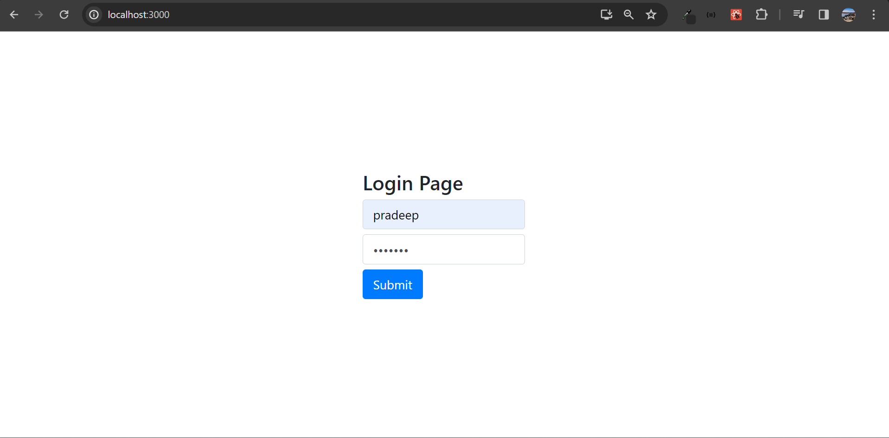
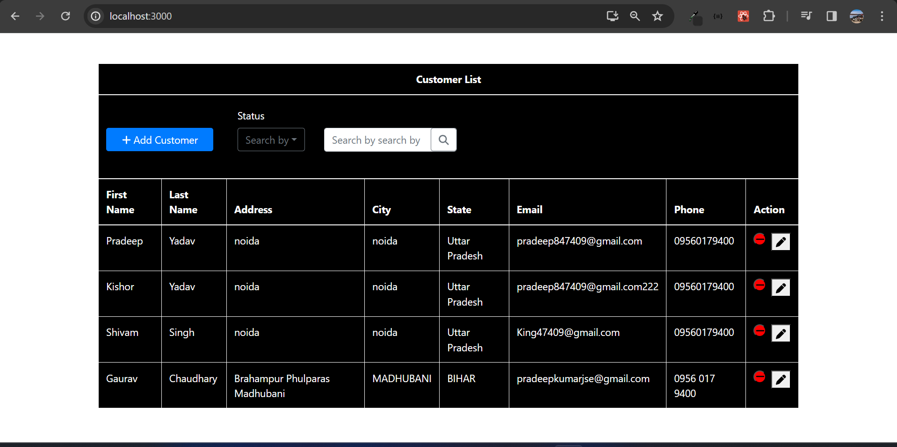
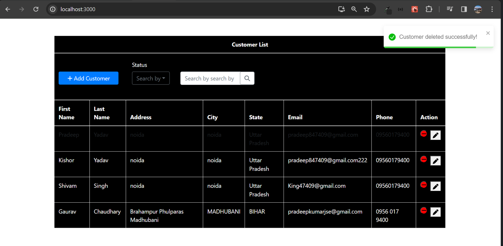
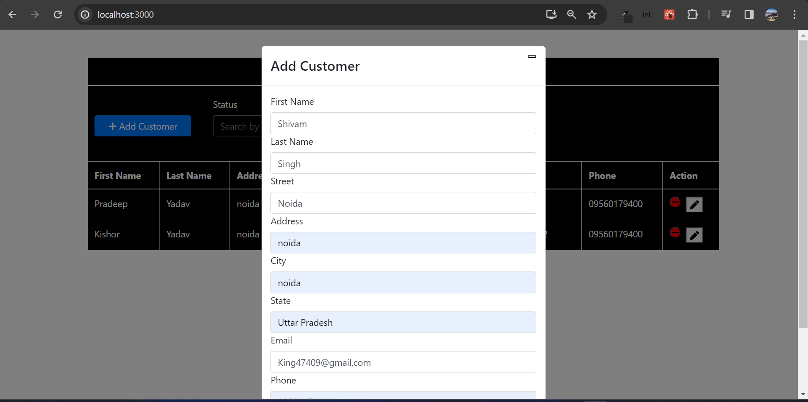

# Frontend for Sunbase Java Assignment

## Overview
This is the frontend repository for the Sunbase Java Assignment. The user interface (UI) is designed for basic functionality, consisting of three screens: Login, Customer List, and Add a New Customer.

## Screens

### Login Screen
The login screen contains input fields for the username and password, along with a submit button. It is the entry point for user authentication.


### Customer List Screen
The customer list screen displays a table of customer data with the following columns: First Name, Last Name, Address, City, State, Email, Phone, and Action. It allows users to view, edit, and delete customer entries. The table also provides a search functionality to filter data based on First Name, City, Email, or Phone.




### Add a New Customer Screen
The "Add a new customer" screen provides input fields for creating a new customer. Users can input details such as First Name, Last Name, Street, Address, City, State, Email, and Phone. Clicking the "Save" button sends a request to the backend API to add the new customer.



## Getting Started
Follow the steps below to set up and run the frontend locally:

1. **Clone the Repository:**
    ```bash
    git clone https://github.com/your-username/sunbase-frontend.git
    cd sunbase-frontend
    ```

2. **Install Dependencies:**
    ```bash
    npm install
    ```

3. **Run the Application:**
    ```bash
    npm start
    ```

4. Open your browser and visit `http://localhost:3000` to view the application.

## Technologies Used
- React
- React Bootstrap
- FontAwesome
- Other relevant dependencies mentioned in `package.json`

## Notes
- Ensure the backend server is running and accessible for API requests.
- Customize the environment variables, API URLs, or other configurations as needed in the code.

Feel free to enhance the UI, add more features, or make improvements based on your project requirements.

Remember to customize the instructions, URLs, and other details based on your actual project setup and requirements.
